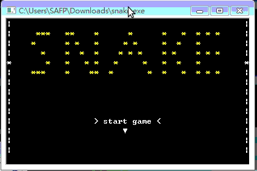

# SNAKE 

> Author : YWS (严伟森)
>
> Email : yws179@gmail.com

这是一个非常简单是贪吃蛇实现，虽然是命令行程序，但我使用WIN API加入了界面效果。

#### 效果展示

由于本人使用Linux系统，无法运行该程序，临时打开远程的windows系统电脑运行，故效果展示呈现卡顿丢帧乱码等现象。待下次更新展示图。

#### 项目由来

大一上学期看完c语言课本后，按捺不住学到技术的兴奋感，于是就想赶紧将自己所学到的东西实践一番，于2015年10月30日开始该项目，几天后历经几个版本完成了仅仅几百行代码的小尝试。

为了验证自己学到的知识，这个程序除了查询c语言文档，winapi文档，主要由自己思考而出，加上当初水平实在有限，可能有许多不足。暂时不做优化，保留原样吧（主要是早就离开了windows系统了），待以后我对自己技术更有信心了(现在也没有什么很好的想法），要是有了兴致再完善一个更全面更有水平的版本。

上传这个让我印象深刻的项目，毕竟这是当年对编程学习热情的开端，是第一个感觉有点内容了的项目

希望我学习的热情能一直如初，永不泯灭…
